# AgenticFinanceAnalyser

> A modular, agent-driven stock analysis system built with LangGraph, OpenAI, and Tavily. It mimics a research desk to generate forward-looking investment memos with real-time web data.

AgenticFinanceAnalyzer orchestrates a network of specialized agents to deliver structured investment insights from live web sources. It breaks down user queries into focused subtasks, retrieves relevant data using Tavily, and delegates each task (financials, sentiment, catalysts, risks, valuation) to an expert AI agent.

Each component is built around LangGraph’s dynamic control flow — allowing intelligent task routing, inter-agent memory, and report generation that feels like it came from a professional equity analyst team.

---

## 💼 Agent Roles

| Agent               | Purpose                                                                 |
|---------------------|-------------------------------------------------------------------------|
| Planner Agent     | Splits the user’s query into targeted research tasks                    |
| Financials Agent  | Extracts revenue, EPS, P/E, EV/EBITDA, net income from trusted sources  |
| Catalyst Agent    | Surfaces forward-looking events, lockups, product launches, SEC actions |
| Sentiment Agent   | Gauges market sentiment using expert commentary and analyst opinions    |
| Valuation Agent   | Compares valuation vs. industry benchmarks (P/E, multiples)              |
| Risk Agent         | Highlights regulatory, operational, or reputational risks               |
| Combine Agent     | Assembles all sections into a Markdown investment memo                  |

---

## 🧠 Features

- Modular, agentic financial research pipeline  
- Real-time search with Tavily (filtering stale data)  
- GPT-4o mini for clean, structured summarization  
- Outputs structured Markdown investment memos  
- Catalyst and sentiment agents focus on **forward-looking alpha**  
---


```mermaid
graph TD
    A[🔍 User Query] --> B[🧭 Planner Agent]
    B --> C1[📊 Financials Agent]
    B --> C2[⚡ Catalyst Agent]
    B --> C3[💬 Sentiment Agent]
    B --> C4[🧮 Valuation Agent]
    B --> C5[⚠️ Risk Agent]
    C1 --> D[🧾 Combine Agent]
    C2 --> D
    C3 --> D
    C4 --> D
    C5 --> D
    D --> E[📄 Final Investment Memo]
```

## 📊 Sample Output Format

```markdown

## Investment Memo – AI Generated (HIMS)

### Financial Snapshot

- **Revenue**: $586M (Q1 2025, Source: Earnings Release)
- **Net Income**: $49.5M (Margin: 8.4%)
- **EPS**: 0.2
- **EV/EBITDA**: 100.5

---

### Catalysts

- [ ] Earnings call and guidance revision (2025-05-05)
- [ ] Launch of new weight loss products in partnership with Novo Nordisk (2025-06-01)
- [ ] Expected announcement of new strategic partnerships or product lines (2025-07-15)

---

### Warnings

- Transition of subscribers off commercially available semaglutide expected to result in a one-time revenue drop in Q2
- Potential headwinds from macroeconomic factors such as tariffs could impact gross margins

---

### Valuation Overview

**HIMS Valuation Metrics:**

- **Market Cap**: $11.63 billion
- **Trailing P/E Ratio**: 49.04
- **Forward P/E Ratio**: 40.85

---

### Comparison with Industry Peers

1. **P/E Ratios**  
   HIMS's trailing P/E of 49.04 and forward P/E of 40.85 are significantly higher than the average P/E ratios in the healthcare and telehealth sectors (typically 20–30 for established companies). This suggests that HIMS is trading at a premium compared to its peers.

2. **Market Cap**  
   With a market cap of $11.63 billion, HIMS is positioned as a mid-cap company within its sector. This valuation places it among the larger players in the telehealth space.

---

### Conclusion: Premium or Discount?

**HIMS is trading at a premium** compared to its industry peers based on both P/E and EV/EBITDA ratios.

---

### Justification of Valuation

- **Growth Potential**: HIMS has demonstrated strong revenue growth and has ambitious growth forecasts, which may justify the higher valuation multiples.
- **Risk Factors**: Risks include potential volatility in its subscriber base and macroeconomic factors that could impact margins. The high beta of 1.65 indicates that HIMS's stock is more volatile than the market, which could deter risk-averse investors.

---

### Final Assessment

While HIMS's premium valuation is supported by its strong growth prospects, the associated risks and high multiples may warrant caution for potential investors. The valuation appears justified if the company can continue to deliver on its growth targets and manage operational risks effectively.

---

### Sentiment Summary

**Sentiment**: Positive  
Despite a significant decline in stock price, HIMS shows strong growth indicators with a substantial increase in subscribers and revenue per subscriber. Analysts maintain a favorable price target suggesting potential upside, and the company's transition to offering branded medications is viewed as a positive development. The outlook for long-term investors remains optimistic.
